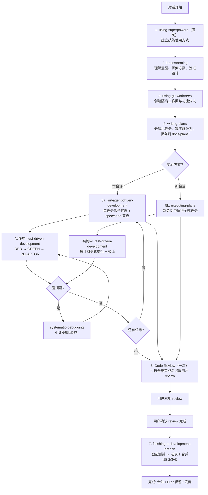
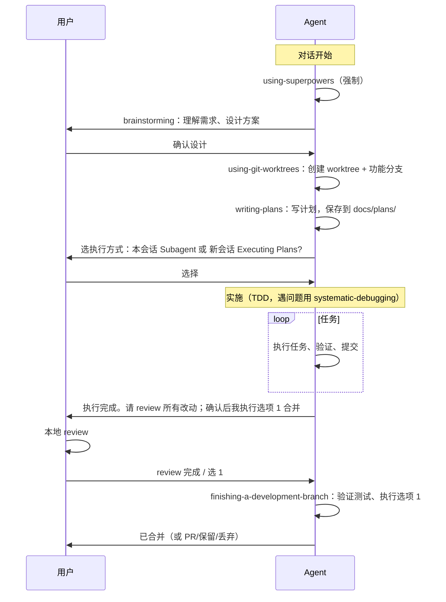
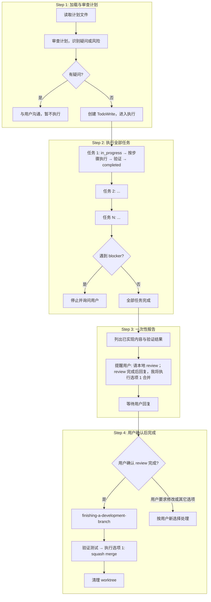

# Superpowers 全流程执行图

本文档描述完整的 Superpowers 开发工作流（从对话开始到合并/完成），以及执行阶段的细节。

## 1. Superpowers 全流程总览

## 2. 全流程时序（简化）

## 3. 阶段与技能对应

| 阶段 | 技能 | 说明 |
|------|------|------|
| 对话开始 | using-superpowers | 强制先建立如何找技能、用技能 |
| 设计 | brainstorming | 理解意图、探索方案、验证设计 |
| 隔离工作区 | using-git-worktrees | 创建 worktree + 功能分支，目录入 .gitignore |
| 计划 | writing-plans | 小任务、文件路径、测试步骤，TDD/YAGNI/DRY |
| 执行方式 | 用户选择 | **Subagent-Driven**（本会话）或 **Parallel Session**（新会话 executing-plans） |
| 实施 | test-driven-development | RED → GREEN → REFACTOR，每 TDD 循环后提交 |
| 遇问题 | systematic-debugging | 4 阶段根因分析、防御性检查 |
| Code Review | 一次（本项目默认） | 全部任务完成后提醒用户 review，确认后执行选项 1 |
| 完成分支 | finishing-a-development-branch | 验证测试 → 4 选项（本地合并/PR/保留/丢弃）→ 清理 worktree |

## 4. Executing Plans 详细流程（Parallel Session）

当用户选择「新会话 + executing-plans」时，在新会话中的具体步骤：

## 5. 相关文件

- 工作流规则：`.cursor/rules/superpowers-workflow.mdc`
- 技能目录：`.cursor/skills/`
  - executing-plans、subagent-driven-development、writing-plans
  - finishing-a-development-branch、test-driven-development、systematic-debugging
  - brainstorming、using-git-worktrees、requesting-code-review、receiving-code-review
